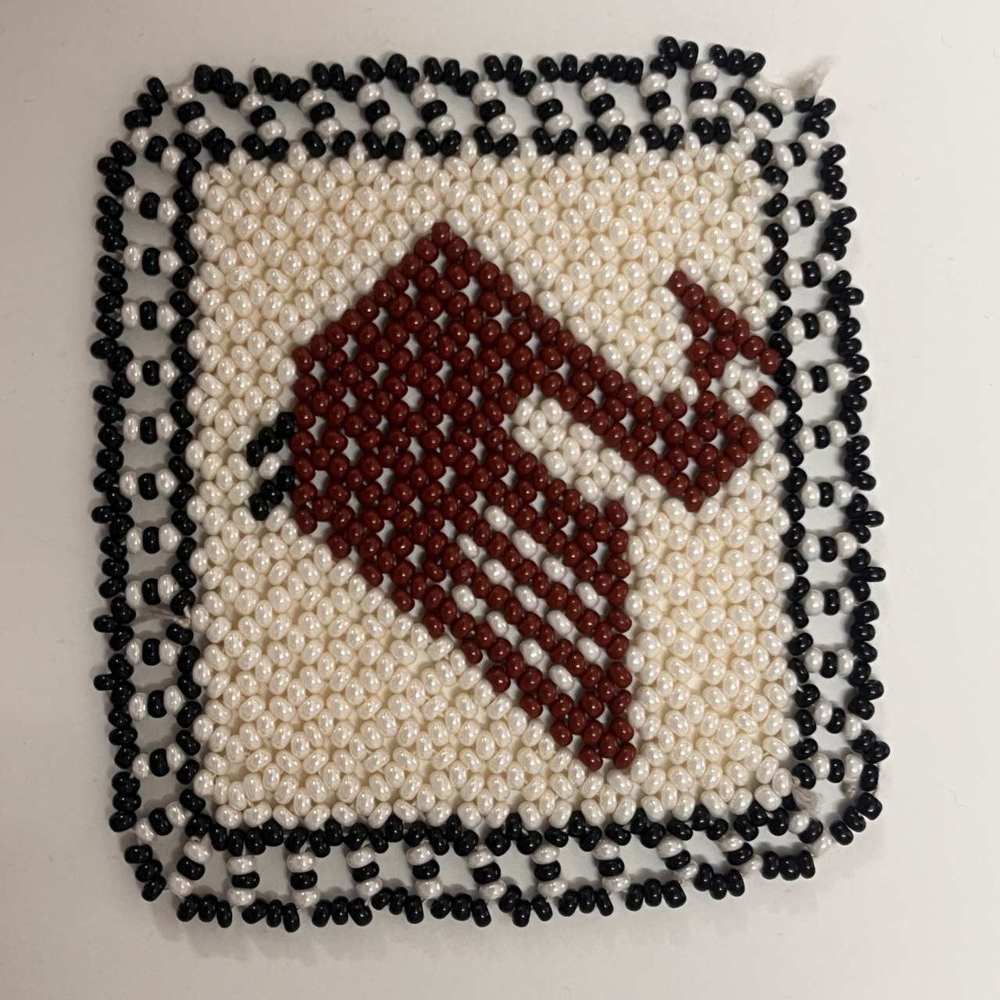
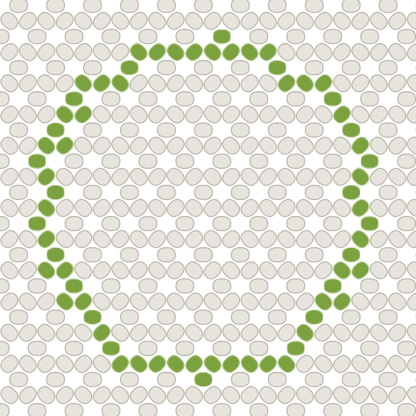
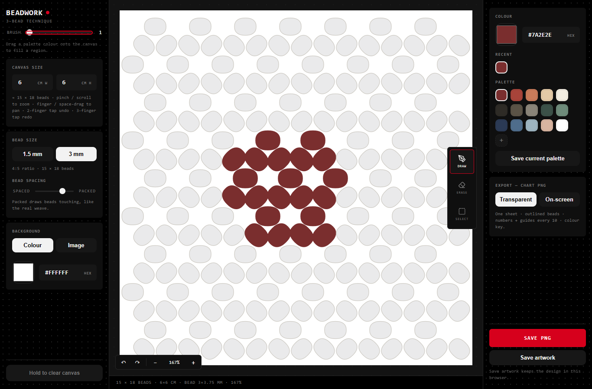
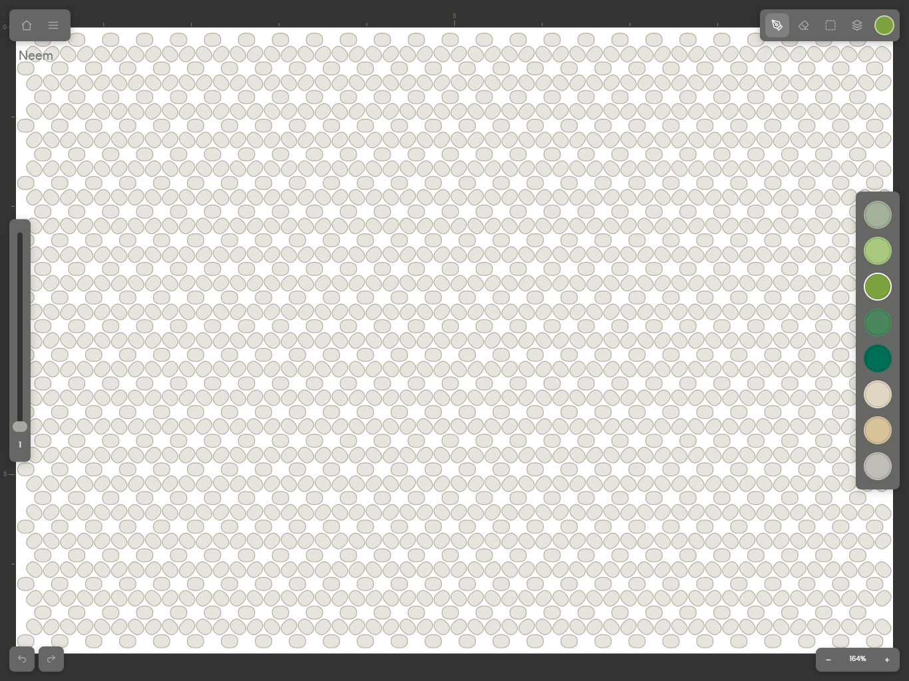
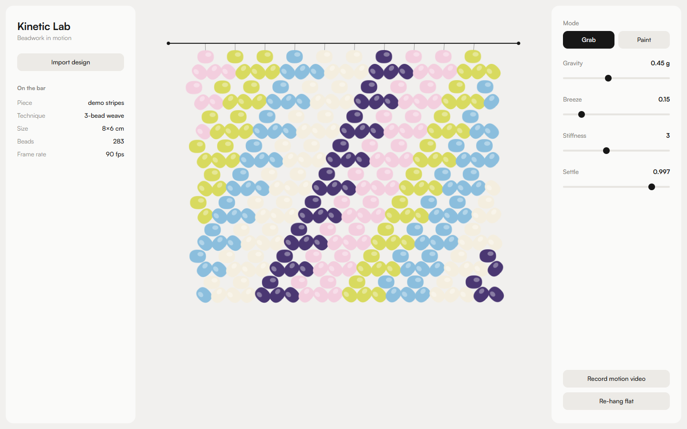

# Internship Progress Report — Beadwork Design Tool

**Intern:** Madhura Deshmukh
**Project:** A browser-based design tool for Kutchi beadwork (3-bead weave)
**Period:** June – July 2026
**Live tool:** https://part-time-artist.github.io/Beadwork-3-tech/

---

## Background: the craft and the problem

The design studio I am interning with works with artisans in Kutch, Gujarat,
who practise a traditional bead-weaving craft. Small glass beads are woven
together with thread into patterned pieces — jewellery, torans, decorative
panels. The weave used here is called the **"3-bead" technique**: the beads
lock together in repeating units of three (one bead sitting on top of two),
which gives the fabric its characteristic dense, honeycomb-like texture.

*A real sample woven in the 3-bead technique. Note that the beads are oval,
and each row nestles into the one above it — nothing like a square pixel grid.*

The studio's role is to design *new* patterns for these artisans. For every
design, the artisan needs a **chart** — a visual map that can be followed
bead-by-bead, showing exactly which colour goes where. The quality of this
chart decides whether the finished piece matches the designer's intention.

**How charts were made earlier, and why it failed:**

1. **By hand** — designers drew every single bead on paper or in a drawing
   app. This is accurate, but a typical piece has thousands of beads, so a
   single chart could take days of repetitive work.

2. **Photoshop pixelation** — the design is drawn as a small pixel image,
   where one pixel = one bead. This is much faster, but it has a hidden
   geometric flaw:
   - Photoshop's pixels are **perfect squares**, arranged in straight rows
     and columns.
   - Real beads are **oval** — roughly 2 units wide for every 3 units tall —
     and in the actual weave every alternate row is **shifted sideways by
     half a bead**, with rows nestling into each other (like bricks in a
     wall, or a honeycomb).

   Because the drawing grid and the real weave have completely different
   shapes, every design comes out **squished and distorted** when it is
   actually woven. A circle drawn in Photoshop becomes a flattened oval in
   beads; proportions of figures and motifs go wrong. Designers could never
   fully trust what they saw on screen, and mistakes were discovered only
   after days of weaving — expensive in both time and material.

## Why a custom tool was needed

No off-the-shelf software understands this weave — pixel editors assume
square grids, and general drawing tools have no concept of beads at all.

The solution was to build our own design tool in which the **drawing grid
itself is constructed from the real geometry of the craft**: the true oval
shape of the beads, their real proportions, and the exact staggered way they
pack together (these values were measured from photographs of actual woven
samples). Every "cell" the designer colours is one bead, drawn at its true
shape and position.

*The tool's canvas: every cell is a true-to-shape oval bead on the staggered
weave grid. A circle drawn here stays a circle when woven — on a square
pixel grid it would come out flattened.*

The result: **what the designer draws on screen is exactly what the artisan
will weave.** There is no distortion to compensate for, because the screen
and the fabric share the same geometry. The tool also had to work well on an
**iPad with Apple Pencil**, since that is how the studio's designers prefer
to sketch, and it runs in an ordinary web browser so nothing needs to be
installed.

## How the tool was built — phases so far

The tool was developed in phases, each one tested with real use before
moving to the next.

**Phase 1 — Getting the geometry right (early June).**
The foundation. Built the drawing canvas: a staggered lattice of oval bead
cells whose spacing comes from measured samples, not guesswork — every
rendering was verified by overlaying screenshots on the reference images
until they matched. On top of this came the basic drawing tools (draw,
erase, and fill — which floods a colour through connected beads of the same
colour), real-world sizing (the designer enters bead size in millimetres and
canvas size in centimetres, and the tool computes how many beads fit), and
export of the finished chart as a PNG image that can be printed or sent to
the artisan.

**Phase 2 — Making it usable in the studio (mid June).**
Turning a working prototype into something a designer can comfortably work
in all day: full iPad and Apple Pencil support (pinch to zoom, two-finger
pan), unlimited undo/redo, and the ability to place a **reference image
behind the grid** so an existing sketch or photo can be traced in beads.
Added selection tools — select a motif, then duplicate, mirror, or move it —
and repeating-pattern tools for borders. Designers can save their own colour
palettes and store multiple named designs. A "packed" viewing mode draws the
beads touching each other, so a motif on screen reads the way the finished
fabric will.

*An early version of the tool: a motif drawn in the "packed" view, where
beads touch as they do in the real weave. Canvas size is set in centimetres
and bead size in millimetres, so the design matches the physical piece.*

**Phase 3 — Structure for real projects (mid–late June).**
Features needed once designs got serious. **Layers** (as in Photoshop): the
background, border, and motif can each live on their own layer and be edited
or hidden independently. A **gallery** stores many artworks on the device,
each with a thumbnail. And the code was restructured so the weave technique
is a pluggable module — the same app now supports both the 3-bead and the
simpler 1-bead weave, and further techniques can be added without rewriting
the tool.

**Phase 4 — Performance and reliability (early July).**
Real studio designs are large — 100×100 beads and more — and at that size
the tool was crashing iPads (a browser tab on an iPad gets a limited amount
of memory). This phase was systematic optimisation: the canvas now redraws
only what actually changed instead of everything on every stroke; when
zoomed far out it draws simplified beads (full detail is invisible at that
size anyway); PNG export was reworked so it no longer freezes the app; and
zooming/panning reuses the last rendered image instead of redrawing
thousands of beads mid-gesture. The tool now stays smooth at realistic
design sizes. A subtle woven **bead texture** was also added so designs on
screen look closer to the real material.

**Phase 5 — A professional interface (8–9 July).**
With the engine solid, the interface was redesigned — first as a mockup in
Figma, then built. The layout is modelled on **Procreate**, the drawing app
studio illustrators already know, so there is nothing new to learn: toolbar
along the top, brush controls on one rail, colour palette on the other.
Also added: hold-to-snap perfect shapes (draw a rough circle, hold, and it
snaps to a true circle — lines, rectangles and polygons too), a library of
real bead colours, and layer groups for organising complex designs.

*The current interface, modelled on Procreate: tools along the top, brush
size on the left rail, colour palette on the right, canvas front and centre.*

**Kinetic Lab (9 July).**
Real beadwork is not a flat image — it hangs, drapes and sways. Kinetic Lab
is a companion tool that loads a finished design and simulates it as a
piece of hanging bead fabric using cloth physics: you can grab it, watch it
swing, and export a short video. The aim is to let clients see how a piece
will *behave* before a single bead is woven.

*Kinetic Lab: a finished design hanging as simulated bead fabric, with
physics controls (gravity, breeze, stiffness) and video export.*

**Phase 6 — Photo import goes live, and the gallery becomes visual (16–17 July).**
The photo-to-bead conversion, built and tested as a separate standalone
prototype, was integrated directly into the editor as an "Import photo as
beads" option in the menu — the standalone prototype was then retired. Two
rounds of fixes followed once real use turned up problems: photos now always
open uncropped (never a silent guess at framing), tapping the photo's
thumbnail opens a dedicated crop mode with Fit/Fill/Done controls, and an
accidental tap outside the import window can no longer discard framing work
— Cancel is the only way to close it.

The "My artworks" gallery was also rebuilt: what used to be a plain text
list (name, technique, bead count, last edited) is now a grid of cards, each
showing a live thumbnail of the actual design. Long-press (or right-click on
desktop) opens Rename / Duplicate / Delete. Alongside this, the layers panel
picked up the touch gestures designers actually expect from apps like
Procreate — a plain swipe scrolls the list, holding a row briefly lifts it
for reordering, and double-tapping a name renames it inline.

**Side exploration — a cross-stitch tool (16–20 July, personal project).**
Outside the Morii Beadwork codebase, I used the same underlying idea — a
drawing grid built from a craft's *real* geometry instead of square pixels —
to start a second tool for cross-stitch embroidery, which has the same
mismatch problem: a stitch drawn as a square pixel doesn't have the same
proportions as a real stitch sewn on aida cloth. I forked the Beadwork
codebase as a starting point, then replaced its bead grid with cross-stitch's
own grid and stitch shapes, ported over the same canvas-first iPad-style
interface, and fixed drawing lag plus added exact stitch shapes and a
three-way brush. This isn't part of the Morii product or launch plan — it's
my own side project — but it's a useful test of whether the approach behind
Beadwork (keep the real geometry separate from the drawing engine) actually
generalises to a different craft, and it does.

## Summary

In about seven weeks the project has gone from a geometry experiment to a
working studio tool: charts are distortion-free by construction rather than
by careful compensation, the tool runs smoothly on the iPads the designers
actually use, the interface is familiar enough to need no training, and the
newest additions (photo import, a visual gallery) round out the everyday
workflow a designer would actually use day to day. Next steps are gathering
feedback from real design work in the studio, refining the kinetic
presentation tool, and — as a personal exploration — seeing how far the same
engine carries into other craft techniques like cross-stitch.
